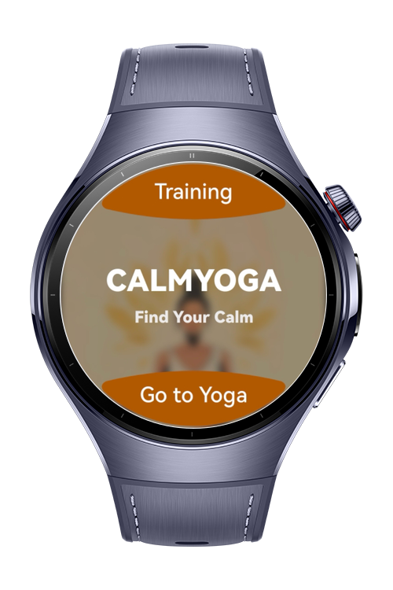
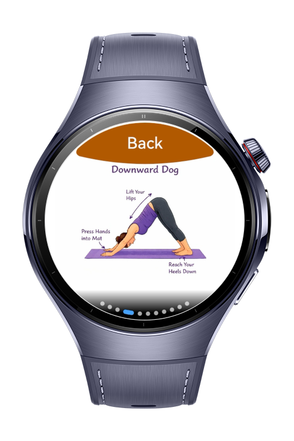
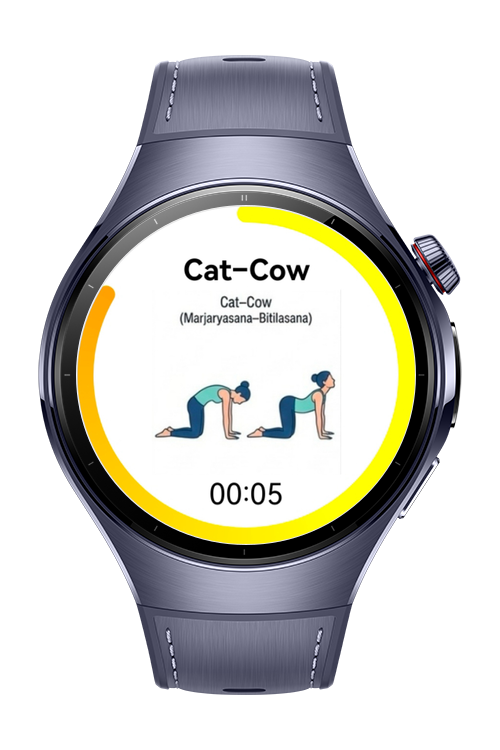
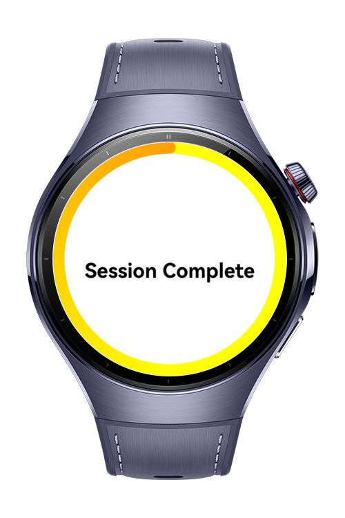

> **Note:** To access all shared projects, get information about environment setup, and view other guides, please visit [Explore-In-HMOS-Wearable Index](https://github.com/Explore-In-HMOS-Wearable/hmos-index).

# CalmYoga

CalmYoga is an interactive yoga companion application specifically designed for HarmonyOS wearables. It aims to provide a seamless and mindful yoga experience by combining visual training with physical haptic feedbacks.

# Preview

<div>
  
  
  
  

</div>


# Use Cases

- CalmYoga offers a dual-layered approach to mindfulness: Interactive Training and Session Management.

- Interactive Training: Users can explore various yoga poses through high-quality visual guides. This section serves as an educational hub where users learn the correct alignment and benefits of each posture.

- Yoga Sessions: Once users are ready to practice, they can start a guided session. In this mode, the app manages specific durations for each pose, helping users focus on their breathing and form without needing to check their watch constantly.

- Haptic Feedback: To ensure a truly "calm" experience, the app utilizes the @ohos.vibrator kit to provide subtle haptic feedback during pose transitions. These vibrations serve as non-intrusive alerts, allowing users to keep their eyes closed or focus on their posture while knowing exactly when to move to the next step.

# Tech Stack


**Languages**: ArkTS

**Frameworks**: HarmonyOS SDK 5.1.0(18)

**Tools**: DevEco Studio Vers 5.1.0.842

**Libraries**: 

- `@kit.ImageKit`
- `@kit.ArkGraphics2D`
- `@kit.ArkUI`
- `@kit.AbilityKit`
- `@ohos.vibrator`


# Directory Structure
```
entry/src/main/
│
├── ets/
│   │
│   ├── entryability/
│   │   └── EntryAbility.ets
│   │
│   ├── entrybackupability/
│   │   └── EntryBackupAbility.ets
│   │
│   ├── model/
│   │   └── YogaModel.ets
│   │
│   ├── pages/
│   │   ├── HomePage.ets
│   │   ├── Index.ets
│   │   ├── TrainingPage.ets
│   │   └── YogaPage.ets
│   │
│   ├── services/
│   │   ├── HapticService.ets
│   │   └── NavigationService.ets
│   │
│   ├── utils/
│   │   └── ImageBlur.ets
│   │
│   └── viewmodel/
│       └── YogaViewModel.ets
│
├── resources/
```


# Constraints and Restrictions

## Supported Device
- Huawei Watch 5


# License

CalmYoga is distributed under the terms of the MIT License. 
See the [LICENSE](/LICENSE) for more information.